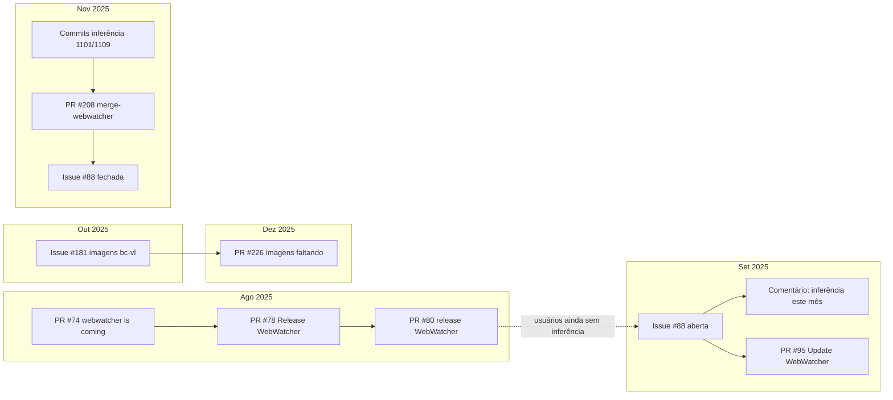

# Parte 1 — Linha do tempo de uma mudança real (GPR: arqueologia de issues)

> **Eixo A (MPS.BR — GPR)** · Atividade 2 · Projeto analisado: [Alibaba-NLP/DeepResearch](https://github.com/Alibaba-NLP/DeepResearch)  
> **Autor da parte:** Guilherme Rosário Alves · **Funcionalidade auditada:** liberação do agente multimodal **WebWatcher** (código de inferência, benchmark e documentação)

---

## 1. Objetivo e ligação com a Atividade 1

Na **Atividade 1**, a equipe mapeou trilhas de rastreabilidade **pontuais e bem conduzidas** — por exemplo, a correção ligada à [Issue/PR #233](https://github.com/Alibaba-NLP/DeepResearch/pull/233), o defeito [#14](https://github.com/Alibaba-NLP/DeepResearch/issues/14) e a atualização de benchmark [#181](https://github.com/Alibaba-NLP/DeepResearch/issues/181). Esses casos mostram que *é possível* ligar relato público → PR → commits → arquivos.

Esta Parte 1 investiga o **lado oposto**: uma funcionalidade “pesada”, com pressão da comunidade e entrega fragmentada no tempo. O epicentro é a [Issue #88](https://github.com/Alibaba-NLP/DeepResearch/issues/88) (*“WebWatcher相关的代码找不到”* — usuário não encontra o código prometido). O objetivo é reconstruir o fio **issue(s) → comentários → PR(s) → commits → arquivos**, avaliar se a rastreabilidade **na prática** é forte ou só pontual (como já sugerido em [requisitos-rastreabilidade-gre.md](https://github.com/athena272/ES_2026-2_DeepResearch/blob/main/docs/requisitos-rastreabilidade-gre.md) da A1).

**Hipótese de trabalho:** para features grandes no monorepo `WebAgent/`, o processo observável no GitHub privilegia comunicação em README e merges rápidos, sem amarrar issues de usuários externos aos PRs que efetivamente entregam código executável.

---

## 2. Visão geral da linha do tempo

| Data | Artefato | Resumo da mudança | Vínculo com #88 |
|------|----------|-------------------|-----------------|
| 2025-08-06 | [PR #74](https://github.com/Alibaba-NLP/DeepResearch/pull/74) | README + figura de roadmap (`assets/road_map_webwatcher.png`) | Nenhum — issue ainda não existia |
| 2025-08-13 | [PR #78](https://github.com/Alibaba-NLP/DeepResearch/pull/78) | Atualização de status no README | Nenhum |
| 2025-08-15 | [PR #80](https://github.com/Alibaba-NLP/DeepResearch/pull/80) | Merge “release WebWatcher”; corpo do PR vazio | Nenhum |
| 2025-09-01 | [Issue #88](https://github.com/Alibaba-NLP/DeepResearch/issues/88) | Usuário externo não localiza código WebWatcher | **Epicentro** |
| 2025-09-08 | Comentário em #88 | Mantenedor: inferência “será publicada este mês” | Define escopo = **código de inferência** |
| 2025-09-16 | [PR #95](https://github.com/Alibaba-NLP/DeepResearch/pull/95) | Descrições WebWatcher (+13/−5 linhas, 1 arquivo) | Paralelo; não referencia #88 |
| 2025-10-01 | [Issue #181](https://github.com/Alibaba-NLP/DeepResearch/issues/181) | Imagens do benchmark BrowseComp-vl ausentes | Sub-problema do mesmo “release” |
| 2025-11-02–09 | Commits `6d2eeae`, `dc87c85` | Centenas de linhas em `WebAgent/WebWatcher/infer/` | Entrega real de inferência |
| 2025-11-10 | [PR #208](https://github.com/Alibaba-NLP/DeepResearch/pull/208) | Merge da branch `merge-webwatcher` | Sem `Closes #88` |
| 2025-11-09–10 | Fechamento #88 | Comentários apontam pasta `WebAgent/WebWatcher` | Resolução **verbal**, não por link de PR |
| 2025-12-17 | [PR #226](https://github.com/Alibaba-NLP/DeepResearch/pull/226) | Correção de imagens faltantes (8 arquivos) | Eco de #181 / [#224](https://github.com/Alibaba-NLP/DeepResearch/issues/224) |

**Verificação local (clone DeepResearch):** `git log --grep="#88"` não retorna commits; `git log --grep="WebWatcher"` lista merges #74, #78, #80, #95, #181, #208, #226, entre outros.

**Arquivos centrais no repositório analisado:**

- `WebAgent/WebWatcher/infer/` — scripts e avaliação de inferência (entrega tardia, nov/2025)
- `WebAgent/WebWatcher/benchmark/` — JSONL BrowseComp-vl (issue #181)
- `README.md` (raiz) e `WebAgent/README.md` — onde usuários buscavam links e status

---

## 3. Arqueologia passo a passo

### 3.1 Abertura da issue e escopo implícito

| | |
|---|---|
| **Evidência** | [Issue #88](https://github.com/Alibaba-NLP/DeepResearch/issues/88) — aberta em **2025-09-01** por [@2132660698](https://github.com/2132660698) (associação: NONE, usuário externo). Título: *“WebWatcher相关的代码找不到”*. Corpo (traduzido): pergunta se o código citado na documentação já foi publicado e onde encontrá-lo. Evidência visual: [issue-88-abertura](../assets/parte1/README.md#issue-88-abertura). |
| **Diagnóstico** | O relato trata de **localizabilidade** do artefato, não de um bug pontual. Isso expõe ambiguidade entre “projeto anunciado no paper/README” e “código executável no repositório”. Não há template de issue pedindo caminho, versão ou critério de “publicado”. |
| **Recomendação** | Adotar template de issue do tipo *“missing artifact”* com campos: artefato esperado (código / dados / demo), URL ou seção do README citada, commit ou tag em que o usuário esperava encontrar o material. |
| **Risco** | **Médio** — sem escopo explícito, a equipe mantenedora e a comunidade falam de coisas diferentes (docs vs inferência). |

---

### 3.2 Discussão nos comentários (expectativa e atraso)

| | |
|---|---|
| **Evidência** | Thread em [#88](https://github.com/Alibaba-NLP/DeepResearch/issues/88#issuecomment-3265053395): em **2025-09-08**, [@wangxinyu0922](https://github.com/wangxinyu0922) (MEMBER) responde: *“我们还在整理相关的推理代码，预计这个月发布”* (“ainda estamos organizando o código de inferência relacionado; previsão de publicar **este mês**”). Entre set e out, vários comentários “同问” (mesma pergunta) de outros usuários; em **2025-10-21**, [@iyuge2](https://github.com/iyuge2) cobra novamente o prazo. Evidências visuais: [comentário set/2025](../assets/parte1/README.md#issue-88-comentario-set), [cobrança out/2025](../assets/parte1/README.md#issue-88-comentario-out). |
| **Diagnóstico** | A discussão **redefine o escopo** da entrega: não é só “código WebWatcher”, e sim **código de inferência** (`推理代码`). A promessa temporal (“este mês” = setembro/2025) não se cumpre na percepção dos usuários; a entrega efetiva do núcleo `infer/` ocorre em **novembro** (commits `6d2eeae`, `dc87c85`). Há **mudança de escopo no tempo** sem atualizar a issue com checklist ou milestone. |
| **Recomendação** | Em issues de release, registrar milestone com data revisada, lista de artefatos (infer, benchmark, README) e comentário fixado (pinned) quando o escopo mudar. Prática GPR: **monitoramento** de compromissos públicos. |
| **Risco** | **Alto** — quebra de confiança da comunidade; usuários não conseguem planejar reprodução de resultados do paper. |

---

### 3.3 PRs de agosto: “Release” sem código de inferência

| | |
|---|---|
| **Evidência** | [PR #74](https://github.com/Alibaba-NLP/DeepResearch/pull/74) (*“webwatcher is coming”*, merge **2025-08-06**): altera `README.md` e adiciona `assets/road_map_webwatcher.png` (2 arquivos). [PR #78](https://github.com/Alibaba-NLP/DeepResearch/pull/78) (*“Update README.md”*, **2025-08-13**): body *“更新webwatcher状态”*. [PR #80](https://github.com/Alibaba-NLP/DeepResearch/pull/80) (título interno *“Patch 1”*, mensagem de merge *“release WebWatcher”*, **2025-08-15**): **body nulo**, merged por [@callanwu](https://github.com/callanwu), **0 comentários de review** (API GitHub). Evidência visual: [pr-80-merge](../assets/parte1/README.md#pr-80-merge). |
| **Diagnóstico** | Os merges de agosto comunicam **lançamento** no nível de documentação/roadmap, **não** entrega do que a issue #88 pedirá semanas depois (inferência). Títulos de PR e mensagens de commit criam **falsa sensação de completude** para quem só lê o histórico superficial. Nenhum PR referencia #88 (ainda inexistente) nem descreve o que falta entregar. |
| **Recomendação** | Separar PRs de *docs/announcement* de PRs de *code release*; no título ou label usar `docs` vs `feat(webwatcher-infer)`. Exigir descrição mínima no PR (o que entra, o que fica de fora). |
| **Risco** | **Alto** — desalinhamento entre narrativa de “release” e artefato executável; reforça o achado da A1 sobre ausência de **releases versionadas** no GitHub. |

---

### 3.4 Atividade paralela (set/out) sem fechar #88

| | |
|---|---|
| **Evidência** | [PR #95](https://github.com/Alibaba-NLP/DeepResearch/pull/95) (**2025-09-16**): *“Update WebWatcher”*, +13/−5 em **1 arquivo**, 0 reviews. [Issue #181](https://github.com/Alibaba-NLP/DeepResearch/issues/181) (**2025-10-01**): *“bc-vl缺少图片文件”* — benchmark com caminhos de imagem sem arquivos; fechada com *“已更新”* em **2025-10-11** sem PR vinculado na UI; commit posterior `eb0c36d` — `update BrowseComp-vl benchmark of WebWatcher (#181)`. |
| **Diagnóstico** | O time avança **fragmentos** (texto no README, JSONL de benchmark) enquanto a #88 permanece aberta. Sub-requisitos (#181) têm ciclo mais curto, mas ainda com rastreabilidade **commit-message → issue** apenas no merge final do benchmark, não na conversa da #88. |
| **Recomendação** | Agrupar issues relacionadas (`webwatcher-release`) e fechar #88 apenas quando um PR listar explicitamente: inferência + benchmark utilizável + README atualizado. |
| **Risco** | **Médio** — entregas parciais sem visão integrada; quem segue só a #88 não vê progresso estruturado. |

---

### 3.5 Commits e PR de novembro: entrega real de inferência

| | |
|---|---|
| **Evidência** | Commits no histórico local: `6d2eeae` (**2025-11-02**, mensagem `1101`) e `dc87c85` (**2025-11-09**, mensagem `1109`) — dezenas de arquivos em `WebAgent/WebWatcher/infer/` (ex.: `evaluate_hle_official.py`, `agent_eval.py`, ajustes em `vl_search_image.py`). Merge [PR #208](https://github.com/Alibaba-NLP/DeepResearch/pull/208) `merge-webwatcher` em **2025-11-10** (`488032a`). Nenhuma mensagem referencia `#88`. Evidências visuais: [pr-208-merge](../assets/parte1/README.md#pr-208-merge), [commit-dc87c85-stat](../assets/parte1/README.md#commit-dc87c85-stat). |
| **Diagnóstico** | Aqui ocorre a **mudança técnica pesada** que a issue pedía desde setembro. Mensagens de commit opacas (`1101`, `1109`) prejudicam auditoria forense; o vínculo com a demanda pública (#88) só pode ser inferido por data e pasta, não por metadados Git. |
| **Recomendação** | Padronizar commits/PRs com referência `Closes #88` quando aplicável; mensagens descritivas (`feat(webwatcher): release infer scripts and eval`). |
| **Risco** | **Médio** — código existe, mas **rastreabilidade reversa** (issue → commit) continua fraca para terceiros. |

---

### 3.6 Fechamento da issue e correção posterior (dez)

| | |
|---|---|
| **Evidência** | [#88 fechada 2025-11-09](https://github.com/Alibaba-NLP/DeepResearch/issues/88#issuecomment-3508499255): [@ornamentt](https://github.com/ornamentt) (COLLABORATOR): *“在webagent/webwatcher这个文件夹里”*. Em seguida [@wangxinyu0922](https://github.com/wangxinyu0922): *“Hi all, the inference code of WebWatcher has now released!”* (**2025-11-10**). [PR #226](https://github.com/Alibaba-NLP/DeepResearch/pull/226) (**2025-12-17**): *“fix the bug of missing images”*, branch `webwatcher1217`, 8 arquivos, 0 reviews — eco da cadeia de assets do benchmark. Evidência visual: [issue-88-fechamento](../assets/parte1/README.md#issue-88-fechamento). Contraste A1: [pr-233-linked](../assets/parte1/README.md#pr-233-linked). |
| **Diagnóstico** | O fechamento **não** aponta PR nem commit; é orientação de caminho + anúncio. Um auditor que parta só da #88 não vê automaticamente o merge #208 na timeline da issue (GitHub “Development” vazio). A correção de imagens (**dezembro**) mostra que o “release” de novembro ainda estava incompleto para reprodução fiel do benchmark. |
| **Recomendação** | Ao fechar, comentar com links: PR #208, commits principais, seção do README com quick start. Publicar **release note** ou tag `webwatcher-infer-v1`. |
| **Risco** | **Alto** — reprodutibilidade e GRE: requisito “código disponível” fica dependente de interpretação humana dos comentários. |

---

## 4. Contraste com trilha “forte” (Atividade 1)

| Aspecto | Issue #233 (A1) | Issue #88 (esta parte) |
|---------|-----------------|------------------------|
| Autor | Contribuidor externo (PR próprio) | Usuário externo (só issue) |
| Integração | [PR #233](https://github.com/Alibaba-NLP/DeepResearch/pull/233) homônimo, merge **2026-01-08** | Vários PRs (#74–#80, #95, #208) **sem** referência a #88 |
| Commits | `f4b6a05` — `fix parse_retry_times bug (#233)` | `1101` / `1109` — mensagens não descritivas |
| Arquivos | `inference/tool_visit.py`, `inference/tool_python.py` | `WebAgent/WebWatcher/infer/**` (monorepo aninhado) |
| Discussão | 1 comentário; escopo claro no body do PR | 10 comentários; escopo evolui (código → inferência → pasta) |

**Conclusão:** a rastreabilidade no DeepResearch é **forte em correções pontuais** e **fraca em funcionalidades grandes** anunciadas no roadmap — exatamente o gap que a A1 apontou de forma qualitativa; a #88 materializa esse gap com evidência longitudinal.

---

## 5. Síntese GPR (MPS.BR) e classificação global

| Dimensão GPR | Achado |
|--------------|--------|
| Planejamento / comunicação | Roadmap e PRs de agosto antecipam “release” sem definir entregáveis verificáveis |
| Monitoramento | Issue #88 aberta ~70 dias; promessa de setembro não refletida em milestone |
| Controle de mudança | Entrega real dispersa em branch, commits opacos e merge #208 |
| Rastreabilidade (GRE) | Quase nula entre #88 e artefatos Git; melhor em sub-issue #181 via mensagem de commit |

**Recomendações prioritárias (nível G):**

1. **Template de issue + PR** com artefato, caminho no repo e `Closes #NN`.
2. **Label/milestone** `webwatcher` ligando #88, #181, #224, PRs #208 e #226.
3. **Release ou tag** quando inferência + benchmark estiverem utilizáveis (endereça Releases vazias da A1).

**Risco global da funcionalidade auditada:** **Alto** — usuários externos não conseguem, a partir dos artefatos de gestão, reconstruir *o que* foi entregue *quando* e *onde*; isso enfraquece GRE, GPR e a confiança necessária para reproduzir pesquisa com agentes LLM.

---

## 6. Galeria de evidências visuais

Todas as capturas estão em **[assets/parte1/README.md](../assets/parte1/README.md)** (galeria com âncoras por seção):

| Seção | Conteúdo |
|-------|----------|
| [issue-88-abertura](../assets/parte1/README.md#issue-88-abertura) | Abertura da issue |
| [issue-88-comentario-set](../assets/parte1/README.md#issue-88-comentario-set) | Promessa de inferência (set/2025) |
| [issue-88-comentario-out](../assets/parte1/README.md#issue-88-comentario-out) | Cobrança de prazo (out/2025) |
| [issue-88-fechamento](../assets/parte1/README.md#issue-88-fechamento) | Fechamento (nov/2025) |
| [pr-80-merge](../assets/parte1/README.md#pr-80-merge) | PR #80 sem review |
| [pr-208-merge](../assets/parte1/README.md#pr-208-merge) | Merge WebWatcher |
| [commit-dc87c85-stat](../assets/parte1/README.md#commit-dc87c85-stat) | Estatísticas do commit |
| [pr-233-linked](../assets/parte1/README.md#pr-233-linked) | Contraste com trilha forte (A1) |

---

## 7. Integração no relatório PDF

Texto pronto para copiar/colar (2–4 páginas): [docs/relatorio-pdf-parte1.md](./relatorio-pdf-parte1.md) — inclui resumo executivo, tabela de figuras e parágrafo de transição para a Parte 2 (ritmo de PRs).

**Referências**

- Repositório analisado: https://github.com/Alibaba-NLP/DeepResearch  
- Atividade 1 (equipe): https://github.com/athena272/ES_2026-2_DeepResearch  
- Issue central: https://github.com/Alibaba-NLP/DeepResearch/issues/88  
